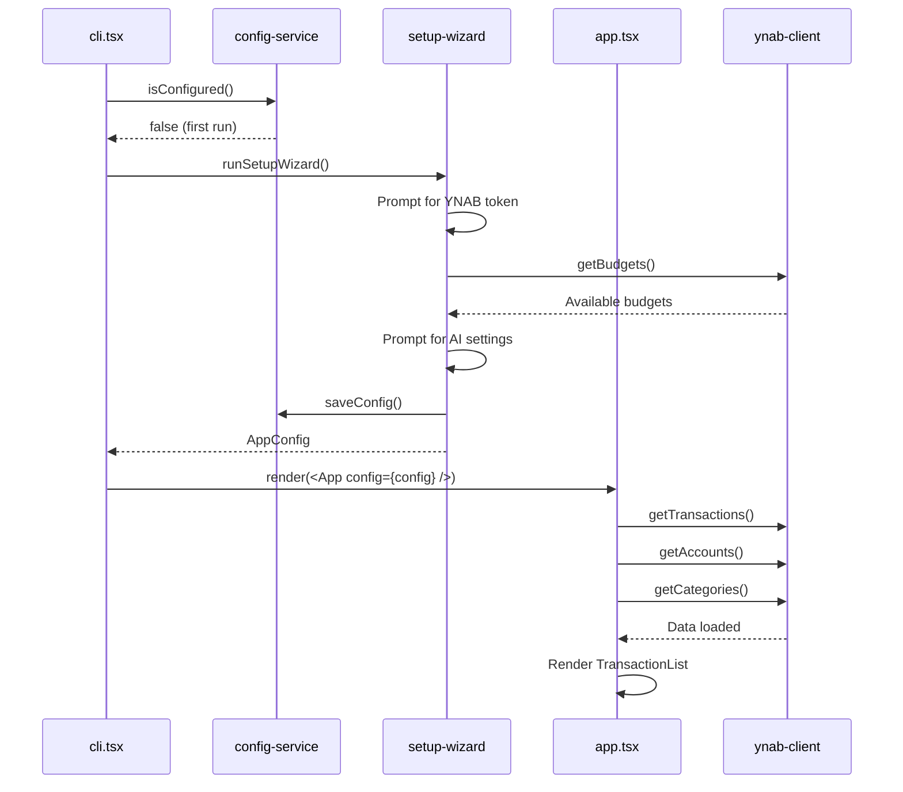
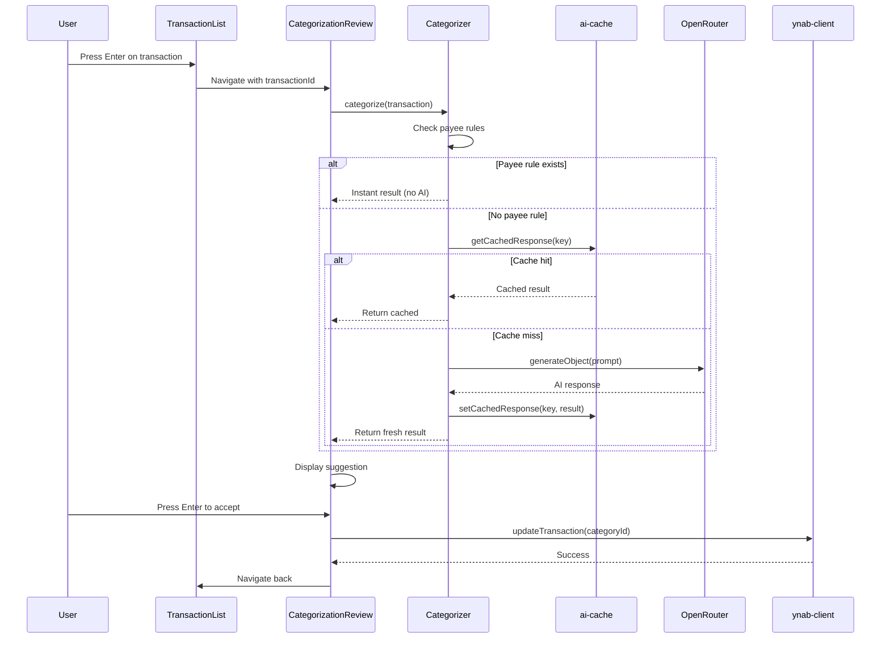
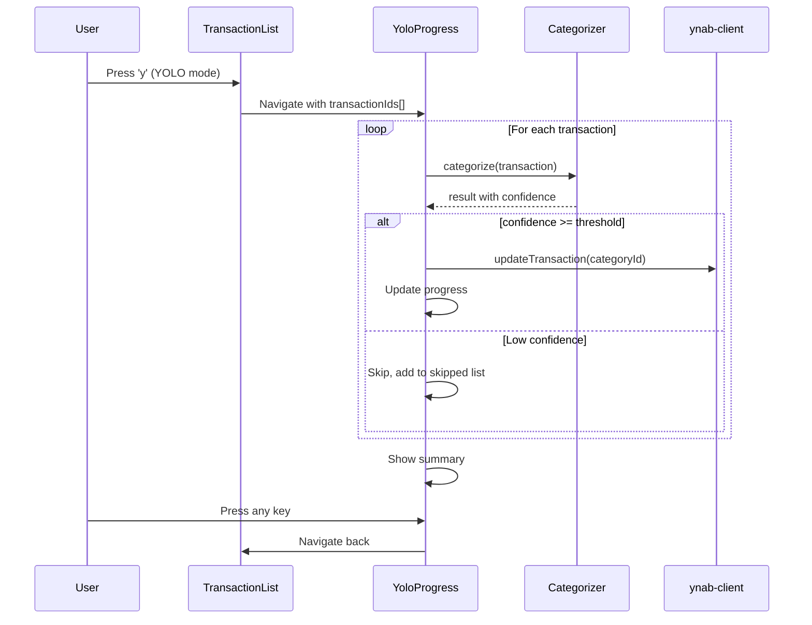
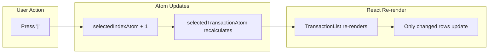
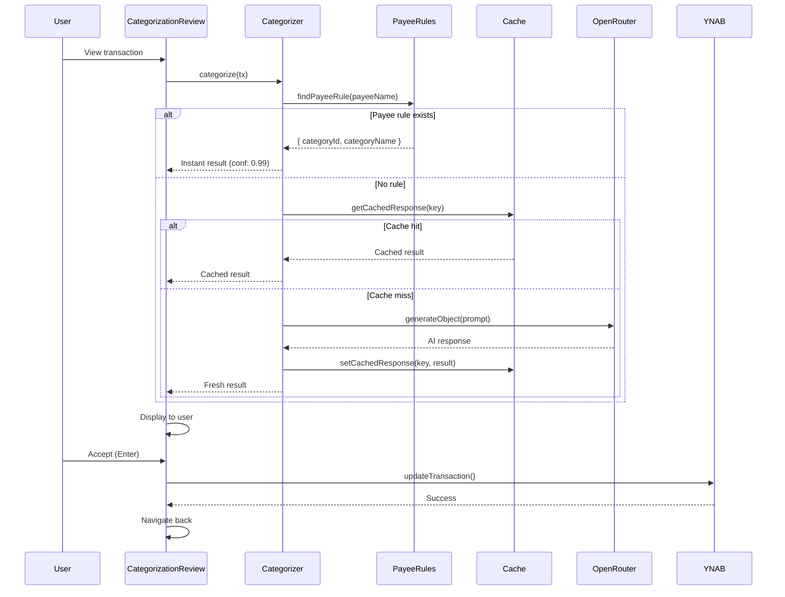
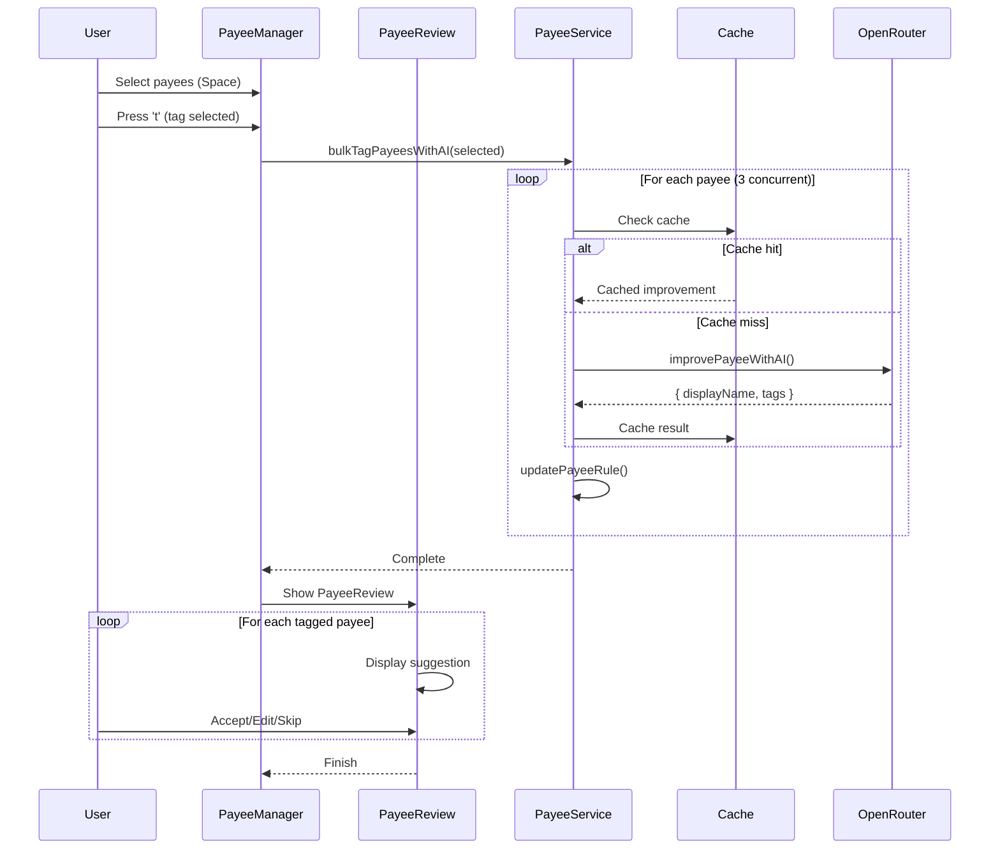
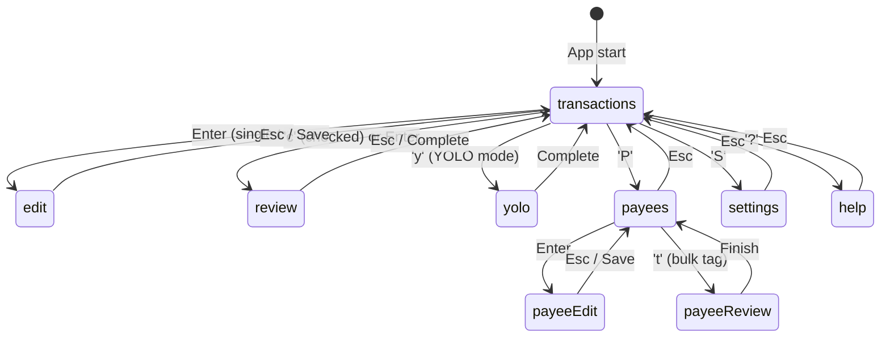

# Technical Architecture

This document provides a deep dive into the architecture, data flows, and design decisions of ynab-tui.

## Table of Contents

- [Overview](#overview)
- [System Architecture](#system-architecture)
- [Data Flow](#data-flow)
- [Component Architecture](#component-architecture)
- [State Management](#state-management)
- [AI Integration](#ai-integration)
- [Caching Strategy](#caching-strategy)
- [Sequence Diagrams](#sequence-diagrams)

---

## Overview

ynab-tui is a terminal-based application built with React Ink that provides AI-powered transaction categorization for YNAB (You Need A Budget). The application follows a domain-driven folder structure with clear separation of concerns.

### Key Design Principles

1. **Domain-Driven Structure** - Code organized by feature, not by type
2. **Atomic State** - Jotai atoms for granular, composable state
3. **Functional Core** - Pure functions with side effects at the edges
4. **Cache-First AI** - Minimize API costs through aggressive caching

---

## System Architecture

```
┌─────────────────────────────────────────────────────────────────────────┐
│                              Terminal (TTY)                              │
└─────────────────────────────────────────────────────────────────────────┘
                                     │
                                     ▼
┌─────────────────────────────────────────────────────────────────────────┐
│                            Ink Renderer                                  │
│                         (React for Terminal)                             │
└─────────────────────────────────────────────────────────────────────────┘
                                     │
                                     ▼
┌─────────────────────────────────────────────────────────────────────────┐
│                           React Components                               │
│  ┌──────────────┐ ┌──────────────┐ ┌──────────────┐ ┌──────────────┐   │
│  │ Transaction  │ │ Categoriza-  │ │    Payee     │ │   Settings   │   │
│  │    List      │ │ tion Review  │ │   Manager    │ │    Screen    │   │
│  └──────────────┘ └──────────────┘ └──────────────┘ └──────────────┘   │
└─────────────────────────────────────────────────────────────────────────┘
                                     │
                                     ▼
┌─────────────────────────────────────────────────────────────────────────┐
│                          Jotai State Store                               │
│  ┌──────────────┐ ┌──────────────┐ ┌──────────────┐ ┌──────────────┐   │
│  │ Transactions │ │  Navigation  │ │   Payees     │ │Categorization│   │
│  │    Atoms     │ │    Atoms     │ │    Atoms     │ │    Atoms     │   │
│  └──────────────┘ └──────────────┘ └──────────────┘ └──────────────┘   │
└─────────────────────────────────────────────────────────────────────────┘
                                     │
                    ┌────────────────┼────────────────┐
                    ▼                ▼                ▼
┌──────────────────────┐ ┌──────────────────┐ ┌──────────────────────────┐
│     YNAB Client      │ │   AI Categorizer │ │     Config Service       │
│  (API Abstraction)   │ │   (OpenRouter)   │ │   (File Persistence)     │
└──────────────────────┘ └──────────────────┘ └──────────────────────────┘
           │                      │                       │
           ▼                      ▼                       ▼
┌──────────────────────┐ ┌──────────────────┐ ┌──────────────────────────┐
│     YNAB REST API    │ │  OpenRouter API  │ │  ~/.config/ynab-tui/     │
│  api.ynab.com/v1     │ │  (Multi-Model)   │ │  ├── config.json         │
└──────────────────────┘ └──────────────────┘ │  ├── payees.json         │
                                              │  └── ai-cache.json       │
                                              └──────────────────────────┘
```

---

## Data Flow

### Application Bootstrap



### Transaction Categorization Flow



### YOLO Mode Flow



---

## Component Architecture

### Screen Hierarchy

```
App (Provider)
├── TransactionList (default screen)
│   ├── StatusBar
│   ├── TransactionRow[] (virtualized)
│   └── KeyHints
├── TransactionEdit
│   └── CategoryPicker
├── CategorizationReview
│   ├── Transaction details
│   ├── AI suggestion display
│   └── CategoryPicker (on 'c')
├── YoloProgress
│   └── Progress bar & stats
├── PayeeManager
│   ├── Payee list (virtualized)
│   ├── PayeeEditor
│   │   └── CategoryPicker
│   └── PayeeReview (bulk tagging)
├── SettingsScreen
│   └── Menu items
└── HelpScreen
    └── Keyboard shortcuts
```

### Component Responsibilities

| Component | Responsibility |
|-----------|---------------|
| `App` | Routing, data loading, Jotai Provider |
| `TransactionList` | Main view, filtering, selection |
| `TransactionRow` | Single transaction display |
| `CategorizationReview` | AI suggestion review UI |
| `YoloProgress` | Bulk auto-categorization |
| `PayeeManager` | Payee list, multi-select, bulk ops |
| `PayeeEditor` | Edit single payee details |
| `PayeeReview` | Review AI-tagged payees one-by-one |
| `CategoryPicker` | Searchable category selection |
| `SettingsScreen` | Configuration menu |
| `HelpScreen` | Keyboard shortcut reference |

---

## State Management

### Jotai Atom Structure

```
┌─────────────────────────────────────────────────────────────────────────┐
│                            Primitive Atoms                               │
│  (Base state - directly settable)                                        │
├─────────────────────────────────────────────────────────────────────────┤
│  transactionsAtom        │ TransactionDetail[]                           │
│  accountsAtom            │ Account[]                                     │
│  categoryGroupsAtom      │ CategoryGroupWithCategories[]                 │
│  selectedIndexAtom       │ number                                        │
│  checkedIdsAtom          │ Set<string>                                   │
│  payeeRulesAtom          │ PayeeRule[]                                   │
│  currentScreenAtom       │ Screen                                        │
│  screenParamsAtom        │ ScreenParams                                  │
└─────────────────────────────────────────────────────────────────────────┘
                                     │
                                     ▼
┌─────────────────────────────────────────────────────────────────────────┐
│                            Derived Atoms                                 │
│  (Computed from primitives - read-only)                                  │
├─────────────────────────────────────────────────────────────────────────┤
│  filteredTransactionsAtom │ Filtered & sorted transactions               │
│  selectedTransactionAtom  │ Currently selected transaction               │
│  checkedTransactionsAtom  │ Array of checked transactions                │
│  categoryMapAtom          │ Map<categoryId, {name, groupName}>           │
│  accountMapAtom           │ Map<accountId, accountName>                  │
│  filteredPayeesAtom       │ Filtered payees by search                    │
│  untaggedPayeesAtom       │ Payees without AI tags                       │
└─────────────────────────────────────────────────────────────────────────┘
                                     │
                                     ▼
┌─────────────────────────────────────────────────────────────────────────┐
│                            Action Atoms                                  │
│  (Write-only atoms that perform actions)                                 │
├─────────────────────────────────────────────────────────────────────────┤
│  navigateAtom             │ Push screen to history                       │
│  goBackAtom               │ Pop screen from history                      │
└─────────────────────────────────────────────────────────────────────────┘
```

### State Flow Example



---

## AI Integration

### Categorizer Architecture

```
┌─────────────────────────────────────────────────────────────────────────┐
│                        createCategorizer()                               │
│  Factory function that returns categorize() and categorizeBatch()        │
└─────────────────────────────────────────────────────────────────────────┘
                                     │
                                     ▼
┌─────────────────────────────────────────────────────────────────────────┐
│                          categorize(tx)                                  │
├─────────────────────────────────────────────────────────────────────────┤
│  1. Check payee rules (instant, no AI)                                   │
│     └── If match → return { categoryId, confidence: 0.99 }               │
│                                                                          │
│  2. Check AI cache                                                       │
│     └── Key: hash(payee + expense/income + model)                        │
│     └── If hit → return cached result                                    │
│                                                                          │
│  3. Call AI (generateObject)                                             │
│     ├── System prompt with:                                              │
│     │   ├── Available categories                                         │
│     │   ├── Historical patterns                                          │
│     │   └── User context                                                 │
│     └── Returns: categoryId, confidence, reasoning, alternatives         │
│                                                                          │
│  4. Validate & cache result                                              │
│     └── Store in cache for 30 days                                       │
└─────────────────────────────────────────────────────────────────────────┘
```

### AI Prompt Structure

```
System Prompt:
┌─────────────────────────────────────────────────────────────────────────┐
│ You are a YNAB transaction categorizer...                                │
│                                                                          │
│ ## Available Categories                                                  │
│ - cat-123: Groceries                                                     │
│ - cat-456: Entertainment                                                 │
│ - cat-789: Dining Out                                                    │
│ ...                                                                      │
│                                                                          │
│ ## Historical Patterns                                                   │
│ - WHOLEFDS → Groceries (45 times, 98% confidence)                        │
│ - NETFLIX → Entertainment (12 times, 100% confidence)                    │
│ ...                                                                      │
│                                                                          │
│ ## User Context                                                          │
│ - Location: Hamburg, Germany                                             │
│ - Languages: German, English                                             │
│ - Partner: Sarah (Split groceries 50/50)                                 │
│                                                                          │
│ ## Rules                                                                 │
│ 1. ONLY use category IDs from the list                                   │
│ 2. Match payee patterns first                                            │
│ 3. Consider amount context                                               │
│ ...                                                                      │
└─────────────────────────────────────────────────────────────────────────┘

User Prompt:
┌─────────────────────────────────────────────────────────────────────────┐
│ Categorize this transaction:                                             │
│ Payee: WHOLEFDS MKT #1234                                                │
│ Amount: expense of 142.50                                                │
│ Memo: [empty]                                                            │
│ Date: 2024-01-03                                                         │
└─────────────────────────────────────────────────────────────────────────┘
```

### Response Schema (Zod)

```typescript
const categorizationResultSchema = z.object({
  categoryId: z.string(),
  categoryName: z.string(),
  confidence: z.number().min(0).max(1),
  reasoning: z.string(),
  alternatives: z.array(z.object({
    categoryId: z.string(),
    categoryName: z.string(),
    confidence: z.number(),
  })).max(3),
  suggestedMemo: z.object({
    short: z.string(),
    detailed: z.string(),
  }).optional(),
})
```

---

## Caching Strategy

### Cache Architecture

```
┌─────────────────────────────────────────────────────────────────────────┐
│                         AI Cache System                                  │
├─────────────────────────────────────────────────────────────────────────┤
│                                                                          │
│  ┌─────────────────┐     ┌─────────────────┐     ┌─────────────────┐   │
│  │  Memory Cache   │ ──▶ │   File Cache    │ ──▶ │   AI Provider   │   │
│  │   (in-process)  │     │ (ai-cache.json) │     │   (OpenRouter)  │   │
│  └─────────────────┘     └─────────────────┘     └─────────────────┘   │
│         ▲                        ▲                                       │
│         │                        │                                       │
│         └── First check ─────────┴── Second check                       │
│                                                                          │
└─────────────────────────────────────────────────────────────────────────┘
```

### Cache Key Generation

```typescript
// Payee improvement: same payee always gets same result
generateCacheKey('payee-improve', payeeName, model)
// → MD5 hash of "payee-improve|WHOLE FOODS|gpt-4.1-nano"

// Transaction categorization: payee + direction
generateCacheKey('categorize', payeeName, 'expense' | 'income', model)
// → MD5 hash of "categorize|WHOLE FOODS|expense|gpt-4.1-nano"
```

### Cache Entry Structure

```json
{
  "a1b2c3d4e5f6...": {
    "response": {
      "categoryId": "cat-groceries",
      "categoryName": "Groceries",
      "confidence": 0.92,
      "reasoning": "Whole Foods is a grocery store",
      "alternatives": []
    },
    "timestamp": 1704300000000
  }
}
```

### TTL & Cleanup

- **TTL**: 30 days (configurable via `CACHE_TTL_MS`)
- **Cleanup**: Expired entries removed on cache read
- **Location**: `~/.config/ynab-tui/ai-cache.json`

---

## Sequence Diagrams

### Full Categorization with Caching



### Payee Bulk Tagging



### Navigation State Machine



---

## File Structure Reference

```
src/
├── app.tsx                      # Root component, routing, data loading
├── cli.tsx                      # Entry point, setup orchestration
│
├── categorization/
│   ├── categorization-atoms.ts  # Categorization state atoms
│   ├── categorization-types.ts  # Zod schemas, TypeScript types
│   ├── categorizer.ts           # AI categorizer factory
│   ├── history-analyzer.ts      # Historical pattern extraction
│   ├── CategorizationReview.tsx # Review UI component
│   ├── yolo-atoms.ts            # YOLO mode state
│   └── YoloProgress.tsx         # YOLO progress UI
│
├── categories/
│   └── CategoryPicker.tsx       # Searchable category picker
│
├── config/
│   ├── config-service.ts        # File I/O for config
│   ├── config-types.ts          # Config schemas
│   └── setup-wizard.ts          # First-run setup
│
├── navigation/
│   └── navigation-atoms.ts      # Screen navigation state
│
├── payees/
│   ├── payee-atoms.ts           # Payee state atoms
│   ├── payee-service.ts         # Payee CRUD, AI tagging
│   ├── payee-types.ts           # PayeeRule interface
│   ├── PayeeEditor.tsx          # Edit single payee
│   ├── PayeeManager.tsx         # Payee list view
│   └── PayeeReview.tsx          # Review AI-tagged payees
│
├── settings/
│   └── SettingsScreen.tsx       # Settings menu
│
├── shared/
│   ├── ai-cache.ts              # AI response caching
│   ├── ynab-client.ts           # YNAB API wrapper
│   ├── components/
│   │   ├── HelpScreen.tsx       # Keyboard shortcuts
│   │   ├── KeyHints.tsx         # Bottom hints bar
│   │   └── StatusBar.tsx        # Top status bar
│   └── hooks/
│       ├── index.ts
│       └── useListNavigation.ts # List navigation hook
│
└── transactions/
    ├── transaction-atoms.ts     # Transaction state atoms
    ├── TransactionEdit.tsx      # Edit transaction
    ├── TransactionList.tsx      # Main list view
    └── TransactionRow.tsx       # Single row component
```

---

## Performance Considerations

### Virtual Scrolling

Lists use viewport-based rendering to handle large datasets:

```typescript
const viewportStartAtom = atom(0)
const viewportSizeAtom = atom(30)

// Only render visible items
const visibleItems = items.slice(viewportStart, viewportStart + viewportSize)
```

### Concurrent AI Requests

Batch operations use controlled concurrency:

```typescript
const concurrency = 3
for (let i = 0; i < items.length; i += concurrency) {
  const batch = items.slice(i, i + concurrency)
  await Promise.all(batch.map(processItem))
}
```

### Memo & Effect Optimization

- `useMemo` for expensive derived data (filtering, sorting)
- `useEffect` dependencies carefully managed
- Jotai's atomic updates prevent unnecessary re-renders

---

## Security Notes

- **API Keys**: Stored in `~/.config/ynab-tui/config.json` (user-readable only)
- **No Telemetry**: All data stays local except YNAB & OpenRouter API calls
- **Cache Isolation**: Each user has their own cache directory
